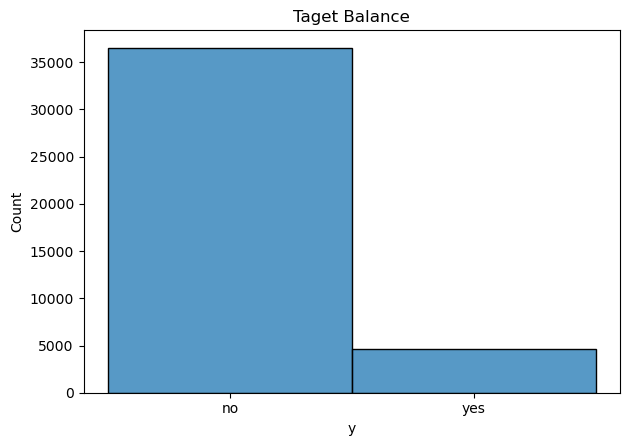
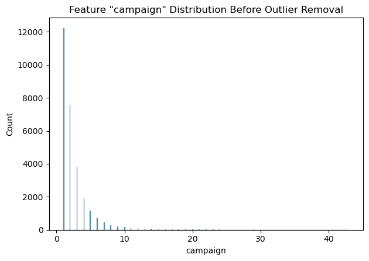
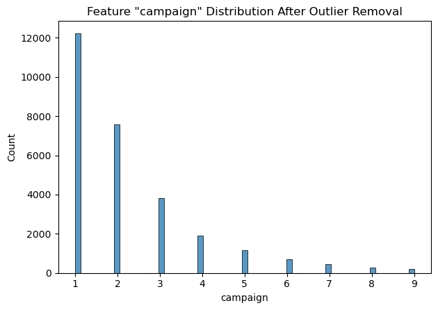
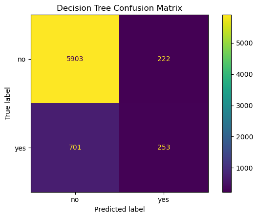
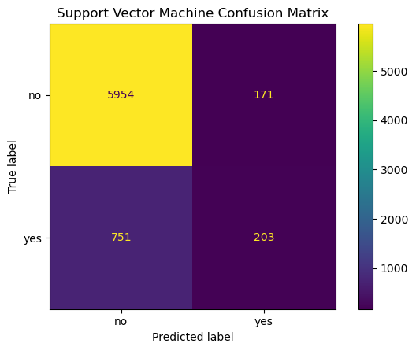
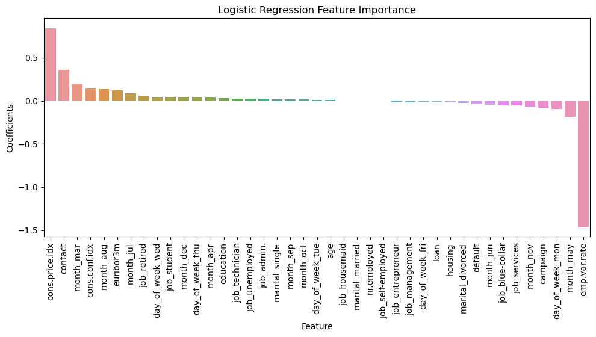

# UCB-MLAI-Practical-Application-3

# Comparing Classifiers

## Business Understanding:

The business objective is to determine how to efficiently use campaign resources to increase client subscriptions. Models will be built to predict if a client will subscribe a term deposit based on the client attributes. Mass campaigns are far less successful than directed marketing campaigns. Knowing customer tendancies will allow the business to determine where to most effectively allocate campaign resources to maximize subscriptions.

The given data set will be used to train four types of classifiers which will be compared for performance:
- Logistic Regression
- K-Nearest Neighbors
- Decision Tree
- Support Vector Machine

## Data:

The data was collected from a Portuguese bank. This bank conducted direct marketing campaigns from its own call center using human agents with some use of the internet. The original dataset represents 17 marketing campaigns conducted between May 2008 and November 2010 for a total of 79354 records [Moro er al. 2014]. The dataset from UCI contains a subset of 41188 records with 21 columns (including the target).

#### Bank client data:
- **age** (numeric)
- **job** type of job (categorical)
- **marital** marital (categorical)
- **education** (categorical)
- **default** has credit in default? (categorical)
- **housing** has housing loan? (categorical)
- **loan** has personal loan? (categorical)
#### Related with the last contact of the current campaign:
- **contact** contact communication type (categorical)
- **month** last contact month of year (categorical)
- **day_of_week** last contact day of the week (categorical)
- **duration** last contact duration, in seconds (numeric)
#### Other attributes:
- **campaign** number of contacts performed during this campaign and for this client (numeric, includes last contact)
- **pdays** number of days that passed by after the client was last contacted from a previous campaign (numeric; 999 means client was not previously contacted)
- **previous** number of contacts performed before this campaign and for this client (numeric)
- **poutcome** outcome of the previous marketing campaign (categorical)
#### Social and economic context attributes:
- **emp.var.rate** employment variation rate - quarterly indicator (numeric)
- **cons.price.idx** consumer price index - monthly indicator (numeric)
- **cons.conf.idx** consumer confidence index - monthly indicator (numeric)
- **euribor3m** euribor 3 month rate - daily indicator (numeric)
- **nr.employed** number of employees - quarterly indicator (numeric)

### Target:
- **y** has the client subscribed a term deposit? (binary: 'yes','no')

## Deliverables:
Detailed finding can be found in this Jupyter Notebook: [prompt.ipynb](https://github.com/jeremystairs/UCB-MLAI-Practical-Application-3/blob/main/prompt_III.ipynb)

Initial data: [data](https://github.com/jeremystairs/UCB-MLAI-Practical-Application-3/tree/main/data)

Images generated during analysis: [images](https://github.com/jeremystairs/UCB-MLAI-Practical-Application-3/tree/main/images)

## Data Understanding

The data was relatively clean in the initial dataset. The numerical features were well distributed with no outliers with one exception, the feature 'campaign'. The documentation stated that the feature 'duration' was of no use. It would be dropped. The catagorical features all had a reasonable number of unique values. The catagorical feartures that required one hot encoding would cause an excessive number of fields in the final dataset.

Many catagorical fields have the value 'unknown'. This is essentially the same as a null value. These values will be replaced with null and the containing rows will be dropped.

The fields around previous contact ('pdays', 'previous', 'poutcome') have little value. Over 95% of rows had no previous contact.

The target was very imbalanced. This will affect the performance of some classifiers and affect the selection of metrics.

Summary of data understanding:
- campaign has outliers above 10 to 20
- no catagorical fields have a high cardinality
- about 5% of row are duplicates
- about 25% of fields have a value 'unknown'
- 'pdays', 'previous', 'poutcome' have little value
- 'default', 'housing', 'loan', and 'contact' can be binary encoded
- 'education' can be ordinally encoded
- 'job' ,'marital', 'month', and 'day_of_week' will be one hot encoded.

## Data Preparation

The initial dataset contained 41,188 records.

Removing duplicates, the dataset was reduced to 39,404 records.

Removing rows with an 'unknown' value reduced the dataset to 29,070 records.

With outliers removed, the dataset was reduced to a final size of 28,315 records.

Features 'duration','pdays', 'previous', and 'poutcome' were dropped.

The catagorical fields 'default', 'housing', 'loan', 'education', 'job' ,'marital', 'month', 'day_of_week' and 'contact' were converted to nemerical features.

## Modeling

The data was modeled in four ways:
- Logistic Regression
- K-Nearest Neighbors
- Decision Tree
- Support Vector Machine

Initial modeling was done with the default values for each classifer. The models were scored with training and test data. The fit time was also measured.

Futher modeling used grid search on a variety of parameters to determine the optimal hyperparameter tuning. Early tests showed a tendenacy toward false negatives. To reduce this tendancy, I tried 'recall' and 'balanced_accuracy' scorers. Both scorers reduced false negatives slightly, but increased false positives considerably. The 'accuracy' scoring metric yielded an accepatable balance.

Once tuned, feature selection was used to determine which fields had the most infulence on the model predictions. 

## Evaluation

#### Comparison of model performance with default hyperparameters:

Model | Training Time (ms) | Training Accuracy | Test Accuracy
---:|:---:|:---:|:---
**Logistic Regression** | 172 | 0.8742 | 0.8698
**K-Nearest Neighbors** | 33 | 0.8965 | 0.8601
**Decision Tree** | 129 | 0.9922 | 0.8069
**Support Vector Machine** | 26813 | 0.8918 | 0.8698

#### Tuned model confusion matrices:

#### Comparison of model performance with tuned hyperparameters:

Model | Training Time (ms) | Training Accuracy | Test Accuracy
---:|:---:|:---:|:---
**Logistic Regression** | 105 | 0.8748 | 0.8713
**K-Nearest Neighbors** | 41 | 0.8840 | 0.8645
**Decision Tree** | 64 | 0.8831 | 0.8696
**Support Vector Machine** | 25491 | 0.8918 | 0.8698

All classifiers had similar performance with Logistic Regression performing the best.

#### Feature Importance:

The **cons.price.idx**, **contact**, **month_march**, **month_may**, and **emp.var.rate** features had the most affect on the Logistic Regression model. 

## Recommendations

Based on the modeling, the features related to the consumer price index, contact communication type, employment variation rate, and month of last contact had the most influence on subscription decision. The contact month of March had a particularly positive impact on the decision to subscribe.

The model could be improved by reducing the number of 'unknown' values. This caused about 25% of the records to be dropped. Considering the target imbalance, the Support Vector Machine had more potential to provide accurate predictions. Unfortunately, hardware limitations only allowed for a few hyperparameter options when tuning. Support Vector classifiers (SVC) are very computationally expensive to model. Faster hardware would allow for a larger number of potential hyperparameters when tuning the SVC.